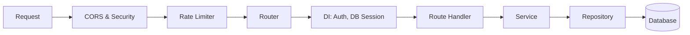

<div align="center">
  <h1>🚀 FastFacebook CRM — Backend API</h1>
  <p><b>Production-grade FastAPI backend for a Facebook Lead Ads CRM & Campaign Management platform.</b></p>
  
  <p>
    
    
    
    
    
    
  </p>
</div>

---

## ✨ Overview

This API powers a comprehensive CRM designed for managing Facebook Lead Ads and Campaigns. It's built on a modern asynchronous stack ensuring high performance, scalability, and secure data handling.

## 🛠️ Tech Stack

| Layer | Technology |
|:---|:---|
| **Framework** | FastAPI 0.115 + Python 3.12 |
| **Database** | PostgreSQL 16 + SQLAlchemy 2 (async) |
| **Migrations** | Alembic |
| **Cache & Queues** | Redis 7 |
| **Background Workers** | Celery 5 |
| **Authentication** | JWT (python-jose) + Facebook OAuth 2.0 |
| **External APIs** | Facebook Graph API v21.0, Marketing API, WhatsApp Cloud API |
| **HTTP Client** | HTTPX (async) + Tenacity retries |
| **Data Validation** | Pydantic v2 |
| **Containerization**| Docker + Docker Compose |

---

## 🚀 Quick Start

### 1. Prerequisites
- Docker & Docker Compose
- Facebook Developer App with required permissions

### 2. Environment Setup

```bash
cp .env.example .env
```
*Edit `.env` and configure your `FACEBOOK_APP_ID`, `FACEBOOK_APP_SECRET`, `SECRET_KEY`, and `JWT_SECRET_KEY`.*

> 💡 **Tip:** Generate a Fernet encryption key for storing tokens securely:
> ```python
> from cryptography.fernet import Fernet
> print(Fernet.generate_key().decode())
> ```
> Paste the output as `ENCRYPTION_KEY` in your `.env` file.

### 3. Run with Docker Compose (Recommended)

```bash
docker-compose up --build
```

**Services Available:**
- 🌐 **API**: [http://localhost:8000](http://localhost:8000)
- 📖 **Swagger Docs**: [http://localhost:8000/docs](http://localhost:8000/docs)
- 🌸 **Flower (Celery monitor)**: [http://localhost:5555](http://localhost:5555)

### 4. Run Locally (Without Docker)

```bash
# Setup virtual environment
python -m venv .venv
source .venv/bin/activate
pip install -r requirements.txt

# Start PostgreSQL and Redis manually, then run:
alembic upgrade head
uvicorn app.main:app --reload --port 8000
```

### 5. Run Celery Workers

```bash
# Leads queue
celery -A app.workers.celery_app.celery_app worker -Q leads --loglevel=info

# Campaigns queue
celery -A app.workers.celery_app.celery_app worker -Q campaigns --loglevel=info
```

---

## 🏗️ Architecture

### Request Flow


<details>
<summary><b>📂 Click to expand Project Structure</b></summary>

```text
app/
├── api/v1/
│   ├── auth/          # Facebook OAuth, JWT tokens
│   ├── facebook/      # Pages, Ad Accounts, forms
│   ├── campaigns/     # CRUD + Facebook sync
│   ├── leads/         # Lead management, status updates
│   ├── analytics/     # Dashboard, CPL, performance
│   ├── webhooks/      # Facebook & WhatsApp webhooks
│   └── whatsapp/      # WhatsApp Campaigns, Templates, Messages
│
├── core/
│   ├── config.py      # Pydantic settings (env-based)
│   ├── database.py    # Async SQLAlchemy engine + session
│   ├── security.py    # JWT, Fernet encryption, password hashing
│   ├── middleware.py  # Request ID, exception handler, security headers
│   ├── exceptions.py  # Typed exception hierarchy
│   └── logger.py      # Structured logging (structlog)
│
├── models/            # SQLAlchemy ORM models
├── schemas/           # Pydantic v2 request/response schemas
├── repositories/      # Data-access layer (async queries)
├── services/          # Business logic layer
├── workers/           # Celery tasks (async via event loop)
└── integrations/
    ├── facebook/      # FacebookGraphClient (HTTPX + retries)
    └── whatsapp/      # WhatsAppCloudClient (Meta Cloud API)
```
</details>

---

## 📡 API Reference

<details>
<summary><b>🔐 Authentication</b></summary>

| Method | Endpoint | Description |
|:---|:---|:---|
| `GET` | `/api/v1/auth/facebook/login` | Get OAuth URL |
| `GET` | `/api/v1/auth/facebook/callback` | OAuth callback (returns JWT) |
| `POST` | `/api/v1/auth/refresh` | Refresh access token |
| `GET` | `/api/v1/auth/me` | Current user profile |
</details>

<details>
<summary><b>👥 Facebook Connections</b></summary>

| Method | Endpoint | Description |
|:---|:---|:---|
| `GET` | `/api/v1/facebook/accounts` | List connected FB accounts |
| `POST` | `/api/v1/facebook/accounts/{id}/sync-pages` | Sync Facebook pages |
| `POST` | `/api/v1/facebook/accounts/{id}/sync-ad-accounts` | Sync ad accounts |
| `POST` | `/api/v1/facebook/pages/{id}/subscribe-webhook` | Subscribe page to leadgen webhook |
| `GET` | `/api/v1/facebook/pages/{id}/forms` | List lead forms |
</details>

<details>
<summary><b>📢 Campaigns</b></summary>

| Method | Endpoint | Description |
|:---|:---|:---|
| `GET` | `/api/v1/campaigns` | List campaigns (paginated) |
| `POST` | `/api/v1/campaigns/sync/{ad_account_id}` | Sync from Facebook |
| `POST` | `/api/v1/campaigns` | Create campaign |
| `GET` | `/api/v1/campaigns/{id}` | Get campaign |
| `PATCH` | `/api/v1/campaigns/{id}` | Update campaign |
| `POST` | `/api/v1/campaigns/{id}/pause` | Pause campaign |
| `POST` | `/api/v1/campaigns/{id}/resume` | Resume campaign |
| `GET` | `/api/v1/campaigns/{id}/insights` | Performance insights |
| `POST` | `/api/v1/campaigns/{id}/sync-adsets` | Sync adsets |
</details>

<details>
<summary><b>🎯 Leads</b></summary>

| Method | Endpoint | Description |
|:---|:---|:---|
| `GET` | `/api/v1/leads` | List leads (paginated + filters) |
| `GET` | `/api/v1/leads/{id}` | Get single lead |
| `PATCH` | `/api/v1/leads/{id}/status` | Update lead status |
| `POST` | `/api/v1/leads/fetch-form-leads` | Bulk pull leads from a form |

> **Filters for `GET /api/v1/leads`**: `campaign_id`, `adset_id`, `form_id`, `page_fb_id`, `status`, `search`, `page`, `page_size`
</details>

<details>
<summary><b>📊 Analytics</b></summary>

| Method | Endpoint | Description |
|:---|:---|:---|
| `GET` | `/api/v1/analytics/dashboard` | Full dashboard summary |
| `GET` | `/api/v1/analytics/leads/count` | Lead count with breakdowns |
| `GET` | `/api/v1/analytics/campaigns/performance` | Campaign performance table |
</details>

<details>
<summary><b>💬 WhatsApp Campaigns</b></summary>

| Method | Endpoint | Description |
|:---|:---|:---|
| `GET` | `/api/v1/whatsapp/templates` | List approved templates |
| `POST` | `/api/v1/whatsapp/campaigns` | Create WhatsApp campaign |
| `GET` | `/api/v1/whatsapp/campaigns` | List campaigns |
| `GET` | `/api/v1/whatsapp/campaigns/{id}` | Get campaign details |
| `POST` | `/api/v1/whatsapp/campaigns/{id}/send` | Trigger campaign dispatch |
| `POST` | `/api/v1/whatsapp/messages/send` | Send single message |
</details>

<details>
<summary><b>🔗 Webhooks</b></summary>

| Method | Endpoint | Description |
|:---|:---|:---|
| `GET` | `/api/v1/webhooks/facebook` | Webhook verification (hub.challenge) |
| `POST` | `/api/v1/webhooks/facebook` | Receive leadgen events |
| `POST` | `/api/v1/webhooks/whatsapp` | Receive message status updates |
</details>

---

## ⚙️ Facebook Setup

1. **Create App:** Go to [Facebook Developers](https://developers.facebook.com/apps), create a **Business** app, and add **Facebook Login**, **Marketing API**, and **Webhooks**.
2. **Permissions:** Ensure you have:
   `ads_management`, `ads_read`, `business_management`, `leads_retrieval`, `pages_show_list`, `pages_read_engagement`, `email`, `public_profile`.
3. **OAuth URI:** Set Valid OAuth Redirect URI to `https://yourdomain.com/api/v1/auth/facebook/callback`.
4. **Webhook:** Use `https://yourdomain.com/api/v1/webhooks/facebook`, verify token from `.env`, and subscribe to `leadgen`.
5. **WhatsApp Setup:** Add the **WhatsApp** product, generate access token, configure webhook to `/api/v1/webhooks/whatsapp`, and subscribe to `messages`.

---

## 🗄️ Database Schema

| Table | Purpose |
|:---|:---|
| `users` | SaaS users (authenticated via Facebook OAuth) |
| `facebook_accounts` | Connected FB user accounts (encrypted tokens) |
| `facebook_pages` | FB Pages owned by users |
| `ad_accounts` | FB Ad Accounts |
| `campaigns` | Campaigns synced/created via Marketing API |
| `adsets` | Ad sets per campaign |
| `ads` | Individual ads |
| `forms` | Lead gen forms per page |
| `leads` | Captured leads with full field data + status |
| `webhook_logs` | Audit log for all incoming webhooks |
| `whatsapp_campaigns`| WhatsApp bulk message campaigns |
| `whatsapp_messages` | Individual messages tracking delivery status |
| `whatsapp_templates`| Synced approved message templates |

**Database Migrations:**
```bash
# Create migration
alembic revision --autogenerate -m "description"
# Apply migrations
alembic upgrade head
```

---

## 🛡️ Security

- 🔒 **Encrypted Tokens:** Facebook tokens encrypted at rest with **Fernet** symmetric encryption.
- 🔑 **JWT Auth:** Short-lived access tokens (60 min) + refresh tokens (30 days).
- 📜 **Signatures:** Webhook payload signature verified with `sha256` HMAC.
- 🛡️ **Headers & Limits:** CORS, strict security headers (HSTS, X-Frame-Options), and Rate Limiting (60 req/min/IP).
- ✅ **Validation:** Pydantic v2 ensures strict input/output schemas.

---

## 🧪 Testing

```bash
# Install dev dependencies
pip install -r requirements.txt

# Run all tests
pytest

# With coverage
pytest --cov=app --cov-report=html

# Run specific tests
pytest tests/test_auth.py -v
```

---

## 💻 Frontend Integration (React/Next.js)

```typescript
// 1. Get OAuth URL
const { data } = await api.get('/api/v1/auth/facebook/login');
window.location.href = data.oauth_url;

// 2. After callback, store tokens
localStorage.setItem('access_token', data.access_token);
localStorage.setItem('refresh_token', data.refresh_token);

// 3. Use Bearer auth on all requests
axios.defaults.headers.common['Authorization'] = `Bearer ${access_token}`;

// 4. Auto-refresh on 401
axios.interceptors.response.use(null, async (error) => {
  if (error.response?.status === 401) {
    const { data } = await api.post('/api/v1/auth/refresh', {
      refresh_token: localStorage.getItem('refresh_token'),
    });
    // Set new tokens and retry original request...
  }
});
```

---

## 📝 Environment Variables Reference

| Variable | Description | Required |
|:---|:---|:---:|
| `DATABASE_URL` | PostgreSQL async URL | ✅ |
| `REDIS_URL` | Redis URL | ✅ |
| `SECRET_KEY` | App secret (min 32 chars) | ✅ |
| `JWT_SECRET_KEY` | JWT signing key | ✅ |
| `ENCRYPTION_KEY` | Fernet key for token encryption | ✅ |
| `FACEBOOK_APP_ID` | Facebook App ID | ✅ |
| `FACEBOOK_APP_SECRET` | Facebook App Secret | ✅ |
| `FACEBOOK_WEBHOOK_VERIFY_TOKEN` | Custom webhook verify token | ✅ |
| `FACEBOOK_REDIRECT_URI` | OAuth callback URL | ✅ |
| `WHATSAPP_PHONE_NUMBER_ID` | Meta WhatsApp Phone Number ID | ⚠️ (WA only) |
| `WHATSAPP_BUSINESS_ACCOUNT_ID` | Meta WhatsApp Business Account ID | ⚠️ (WA only) |
| `WHATSAPP_ACCESS_TOKEN` | System user token for WhatsApp API | ⚠️ (WA only) |
| `APP_ENV` | `development` or `production` | ❌ |
| `DEBUG` | Enable SQL echo + debug logs | ❌ |
| `RATE_LIMIT_PER_MINUTE` | Rate limit (default 60) | ❌ |
